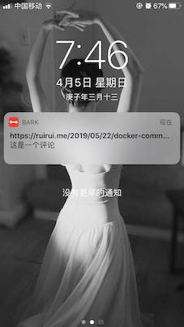

## valine-push

valine comment auto push to your iPhone, based on Bark

## How to run
1. `docker build -t valine-push .`
2. `docker run -d --restart=always --name valine-push-container -e APP_ID="xxx" -e  APP_KEY="xxx" -e SERVER_URLS="xxx" -e BARK_KEY="xxx" -e BLOG_URL="xxx" -p 3000:3000  valine-push:latest
`

env | note
---- | ---
BLOG_URL | your blog url
APP_ID  |  LeanCloud AppID
APP_KEY |  LeanCloud AppKey
SERVER_URLS | LeanCloud REST API
BARK_KEY    | Bark key

